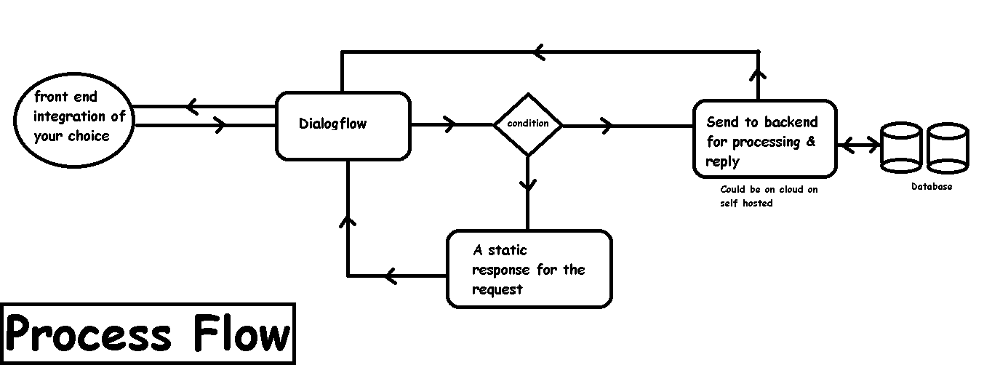
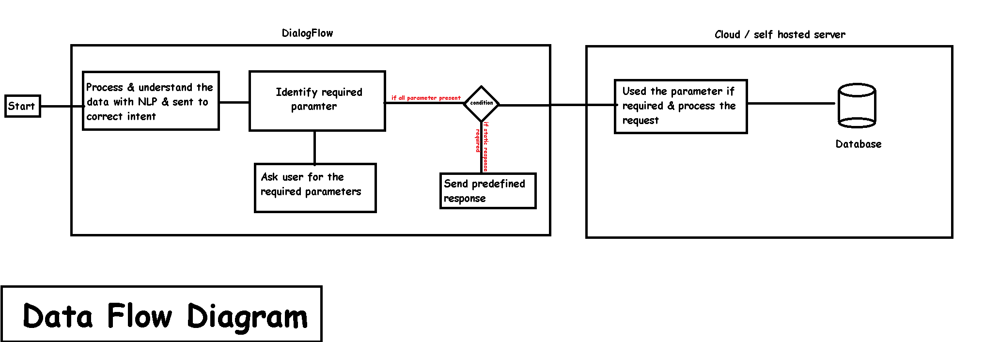

# [Baba GyanChand](https://eyantra-hackathon-kqmkts.web.app/)

## Covid-19 ke gyani


### Description:
**Problem :**
We all are fighting a war. A war with this unknown enemy but the war with this epidemic is not the only one we have to fight, This epidemic has disrupted all the sectors including Aviation, Railways, Automobiles, IT, Food processing, etc. All this disruption in the supply chain is making people panic & they can easily be targeted & manipulated by rumors and false information which can make the situation even worse.

The government is trying their best in managing the situation but they seem to have continuously felling short in the sector of controlling the circulation of the false information. Even their latest attempt of launching a WhatsApp chatbot is just a dumb bot with pre-defined if else loop. Their bot has very limited functionality & can only provide static responses, it's very disappointing to see because it was created by a reputed company & was used by [more than 1.7 Crore Users in 10 Days of Launch](https://gadgets.ndtv.com/apps/news/coronavirus-mygov-corona-helpdesk-chatbot-whatsapp-indian-government-total-users-haptik-2204458).

**Solution :**
The solution I am suggesting is much more robust & artificially intelligent.
My chatbot ([Gyan Chand](https://eyantra-hackathon-kqmkts.web.app/)) is capable of understanding multiple languages, call APIs, fetch data from the database & have a natural conversation. It means that for asking anything you don't have to send a predefined command, a user can ask a question like they usually ask another human & the bot will be able to understand the sent message & process it accordingly. 

This ability allow the bot to do actions which are not possible with current solution implemented by govt like:

- Ability to integrate with all the social platforms used by the public, including integration with the telephonic line so it can be used without the internet or by people who have old non-smart phones.
- Ability to send updates via push notification (webapp & mobile app)
- Ability to provide the latest stats of any Indian state or district.
- Ability to provide stats of any country in the world.
- Ability to provide Latest Updated news about the corona.
- Answer all the frequently asked questions.
- Provide them helpline numbers.
- Scheduling a delivery or health checkup.etc
- Since the request can be sent to our server or our API we can process the data & add further functionality. 


### Hardware and Software Requirements


After integrating all the backend parts can be handled by any server which we are comfortable with. We can either self-host it or we can use any of the cloud solutions for processing the request.

I used,
- PHP (Nodejs or python can be used)
- NodeJs (Firebase clud functiononly support this, else php, python can be used.)
- NPM
- Firebase
- VS Code (or IDE of your choice)


### Process Flow





### Data Flow Diagram





```
 Created for E-Yantra Hackathon
 Team Id: 1716
 Coded by Mr. Jain
  ```